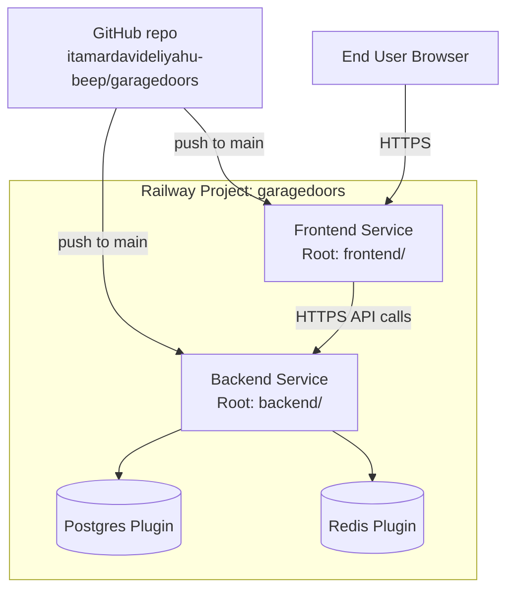
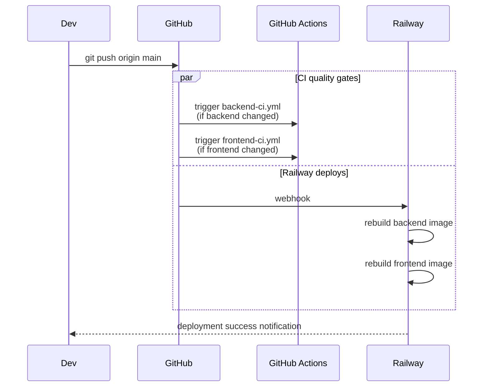

# Deploying LA Garage Doors Pro to Railway

End-to-end guide to take this monorepo from `git push` to a public, production
URL with auto-deploy on every commit to `main`.

> The whole flow takes ~20 minutes the first time. After that, every push to
> `main` redeploys automatically.

---

## תקציר בעברית

המדריך הזה מסביר איך להעלות את הפרויקט ל-Railway:

1. נחבר את ה-GitHub repo ל-Railway.
2. נוסיף Postgres ו-Redis מנוהלים.
3. ניצור 2 services (backend + frontend) שכל אחד מצביע לתיקייה שונה ב-repo.
4. נקבע משתני סביבה, subdomains קבועים, ו-Railway ידפלג אוטומטית בכל push.

---

## Architecture overview



---

## Prerequisites

- A Railway account (https://railway.com - free trial credit available)
- The repo pushed to GitHub at `git@github.com:itamardavideliyahu-beep/garagedoors.git`
- 1 minute to generate a `SECRET_KEY`:
  ```bash
  # Linux/macOS:
  openssl rand -hex 32
  # PowerShell:
  -join ((48..57) + (97..122) | Get-Random -Count 64 | ForEach-Object {[char]$_})
  # Or visit: https://www.random.org/strings/
  ```

---

## Step 1: Create the Railway project

1. Go to https://railway.com/dashboard
2. Click **New Project** → **Deploy from GitHub repo**
3. Authorize Railway to access your GitHub if you haven't already
4. Select the `garagedoors` repository
5. Railway will detect this as a multi-service repo. Cancel the auto-deploy of the
   default service for now — we'll create services manually so the configuration
   is explicit and reproducible.

> **Tip:** Rename the Railway project to `garagedoors-prod` so you can later create
> a `garagedoors-staging` project from the same repo.

---

## Step 2: Add Postgres plugin

1. In the project canvas, click **+ New** → **Database** → **Add PostgreSQL**
2. Railway will provision a managed Postgres instance.
3. Once it's healthy, click on it and copy the **`DATABASE_URL`** value
   (or leave it — we'll reference it dynamically via Railway's `${{...}}` syntax).

---

## Step 3: Add Redis plugin

1. **+ New** → **Database** → **Add Redis**
2. Wait for it to come up healthy.

> Redis is reserved for Phase 2+ (caching, SMS queue). The backend connects to
> it on boot but does not strictly require it for Phase 1. If you want to save
> the resource, you can skip Redis for now and add the plugin later.

---

## Step 4: Create the Backend service

1. **+ New** → **GitHub Repo** → select `garagedoors`
2. After it links, click **Settings** of the new service:
   - **Service name:** `backend`
   - **Source → Root Directory:** `backend`
   - **Source → Watch Paths:** `backend/**` (so frontend-only commits don't trigger
     a backend redeploy)
   - **Build → Builder:** Dockerfile (auto-detected from `backend/Dockerfile`)
   - **Deploy → Healthcheck Path:** `/health` (already set in `railway.toml`)
3. **Networking → Public Networking → Generate Domain.** Set the subdomain to
   `garagedoors-api` so the public URL is `garagedoors-api.up.railway.app`.

### Backend environment variables

In the **Variables** tab of the backend service add:

| Variable                       | Value                                                                       |
| ------------------------------ | --------------------------------------------------------------------------- |
| `APP_ENV`                      | `production`                                                                |
| `DEBUG`                        | `false`                                                                     |
| `SECRET_KEY`                   | *paste a 64-char random hex string here*                                    |
| `DATABASE_URL`                 | `${{Postgres.DATABASE_URL}}` (Railway resolves this at deploy time)         |
| `REDIS_URL`                    | `${{Redis.REDIS_URL}}` (skip if you didn't add Redis)                       |
| `CORS_ORIGINS`                 | `https://garagedoors.up.railway.app` (your frontend URL — see Step 5)       |
| `BUSINESS_NAME`                | `LA Garage Doors Pro`                                                       |
| `BUSINESS_PHONE`               | `+13105551234` *(replace with real number)*                                 |
| `EMERGENCY_PHONE`              | `+13105550911`                                                              |
| `BUSINESS_EMAIL`               | `info@lagaragedoorspro.com`                                                 |
| `BUSINESS_LICENSE`             | `CSLB #1234567`                                                             |
| `WHATSAPP_NUMBER`              | `13105551234`                                                               |
| `ACCESS_TOKEN_EXPIRE_MINUTES`  | `30`                                                                        |
| `WEB_CONCURRENCY`              | `2` *(optional — uvicorn workers; 1 worker uses less memory)*               |

> **Reserved for later** (leave empty for now): `TWILIO_ACCOUNT_SID`, `TWILIO_AUTH_TOKEN`,
> `TWILIO_FROM_NUMBER`, `SENDGRID_API_KEY`, `SENDGRID_FROM_EMAIL`, `OPENAI_API_KEY`.

Click **Deploy**. Watch the logs — you should see uvicorn start and seed data load
on first boot.

Verify:
- Open `https://garagedoors-api.up.railway.app/health` → should return `{"status":"ok"}`
- Open `https://garagedoors-api.up.railway.app/docs` → Swagger UI

---

## Step 5: Create the Frontend service

1. **+ New** → **GitHub Repo** → select `garagedoors` again
2. **Settings:**
   - **Service name:** `frontend`
   - **Source → Root Directory:** `frontend`
   - **Source → Watch Paths:** `frontend/**`
   - **Build → Builder:** Dockerfile
   - **Deploy → Healthcheck Path:** `/`
3. **Networking → Public Networking → Generate Domain.** Set subdomain to
   `garagedoors` → public URL is `garagedoors.up.railway.app`.

### Frontend environment variables

In the **Variables** tab of the frontend service add:

| Variable                  | Value                                                |
| ------------------------- | ---------------------------------------------------- |
| `VITE_API_BASE_URL`       | `https://garagedoors-api.up.railway.app/api/v1`      |
| `VITE_BUSINESS_PHONE`     | `+13105551234`                                       |
| `VITE_EMERGENCY_PHONE`    | `+13105550911`                                       |
| `VITE_WHATSAPP_NUMBER`    | `13105551234`                                        |

> **Important:** Vite inlines `VITE_*` vars at **build time**, not runtime. After
> changing any of these, Railway will need to rebuild the service. It does so
> automatically when you save the variables.

---

## Step 6: Fix the CORS chicken-and-egg

After both services are live, copy the actual frontend public URL and make sure
it appears in `CORS_ORIGINS` on the backend service. If you used the subdomains
suggested above, the value already matches. If Railway gave a different URL
(e.g. you didn't set a subdomain), update it accordingly.

```
CORS_ORIGINS=https://garagedoors.up.railway.app,https://www.lagaragedoorspro.com
```

(Comma-separated — add your real custom domain once you wire one up.)

---

## Step 7: Verify everything

1. **Health check:** `https://garagedoors-api.up.railway.app/health` returns `ok`.
2. **Swagger docs:** `https://garagedoors-api.up.railway.app/docs` shows 27 routes.
3. **Frontend loads:** `https://garagedoors.up.railway.app` shows the marketing site.
4. **Quote calculator works end-to-end:** fill in the wizard → you should see a
   live estimate (proves the backend is reachable from the browser and CORS is OK).
5. **Service area map renders:** the LA polygons load (proves `/services/areas`
   returns data and the seed ran).

---

## Step 8: Custom domain (optional)

In Railway → frontend service → **Settings → Networking → Custom Domain**:
1. Add `lagaragedoorspro.com` (or whichever you own).
2. Railway gives you a `CNAME` to point at.
3. Add the `CNAME` in your DNS provider (Cloudflare, Namecheap, Route 53, ...).
4. Repeat for `api.lagaragedoorspro.com` on the backend service if you want a
   pretty API URL — remember to update `VITE_API_BASE_URL` and `CORS_ORIGINS`.

Railway issues a free Let's Encrypt cert automatically.

---

## Auto-deploy: how it works

Every push to `main` triggers:

1. **GitHub Actions (in parallel):**
   - `Backend CI` — only if `backend/**` changed — runs lint + smoke import.
   - `Frontend CI` — only if `frontend/**` changed — runs `type-check` + build.
2. **Railway (in parallel):**
   - If `backend/**` changed → rebuild + deploy backend service.
   - If `frontend/**` changed → rebuild + deploy frontend service.
   - Both honor the **Watch Paths** you set in Step 4 & 5.



---

## Operations cheatsheet

| Task                                | Where                                                                |
| ----------------------------------- | -------------------------------------------------------------------- |
| Tail backend logs                   | Railway → backend service → **Deployments** → click latest → **Logs** |
| Restart a service                   | Service → **Settings → Restart**                                     |
| Roll back to a previous deploy      | **Deployments** → click any green deploy → **Redeploy**              |
| Open the Postgres CLI               | Postgres plugin → **Data** tab → built-in Railway query tool         |
| Backup Postgres                     | Plugin → **Settings → Backups** (Pro plan)                           |
| Add an env var                      | Service → **Variables → New Variable**                               |
| Pause project to save credits       | Project settings → **Sleep** (optional)                              |
| Add a worker / cron later           | **+ New** → from same repo with a different start command            |

---

## Cost expectations (rough)

For Phase 1 traffic (a marketing site that's just launched in LA):

| Resource              | Approx monthly cost |
| --------------------- | ------------------- |
| Backend (512 MB)      | ~$5 / month         |
| Frontend (NGINX)      | ~$5 / month         |
| Postgres 1 GB         | ~$5 / month         |
| Redis 256 MB          | ~$3 / month         |
| **Total**             | **~$18 / month**    |

Railway's free trial credit ($5) covers a few days; the Hobby plan is $5/month + usage.
You can pause the project when idle to save credits.

---

## Adding SMS notifications later (Phase 2/3)

When you're ready to wire Twilio:

1. Sign up at https://www.twilio.com and buy a US number.
2. On the **backend** service in Railway, add:
   ```
   TWILIO_ACCOUNT_SID=ACxxxxxxxx...
   TWILIO_AUTH_TOKEN=...
   TWILIO_FROM_NUMBER=+13105550123
   ```
3. The Twilio integration module will be added under
   `backend/app/integrations/twilio.py` in Phase 3. The env vars are already
   accepted by [backend/app/core/config.py](backend/app/core/config.py), so
   you can set them now and they'll just be unused until the code lands.

---

## Troubleshooting

| Symptom                                     | Likely cause / fix                                                                                       |
| ------------------------------------------- | -------------------------------------------------------------------------------------------------------- |
| Backend deploy succeeds but `/health` 502   | Healthcheck timed out before app booted. Increase `healthcheckTimeout` in `backend/railway.toml`.        |
| Browser shows CORS error                    | The exact frontend URL is not in `CORS_ORIGINS`. Add it (comma-separated, no spaces, include `https://`). |
| Frontend builds but API calls go to `/api/v1` on the frontend host | Forgot to set `VITE_API_BASE_URL` in the **frontend** service. After setting, redeploy. |
| `psycopg.OperationalError: connection refused` | `DATABASE_URL` not set or Postgres plugin is paused. Verify the `${{Postgres.DATABASE_URL}}` reference. |
| `KeyError: 'PORT'`                          | The Dockerfile already handles this with `${PORT:-8000}` default. If you changed the CMD, restore.       |
| Seed data didn't appear                     | Check backend logs — `seed_initial_data()` is called from the lifespan. It's idempotent and only runs when tables are empty. |

---

## Useful Railway docs

- Config as code: https://docs.railway.com/reference/config-as-code
- Variable references: https://docs.railway.com/guides/variables
- Healthchecks: https://docs.railway.com/reference/healthchecks
- Custom domains: https://docs.railway.com/guides/public-networking
